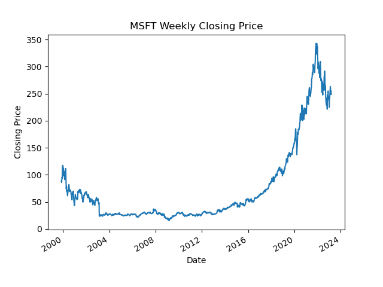
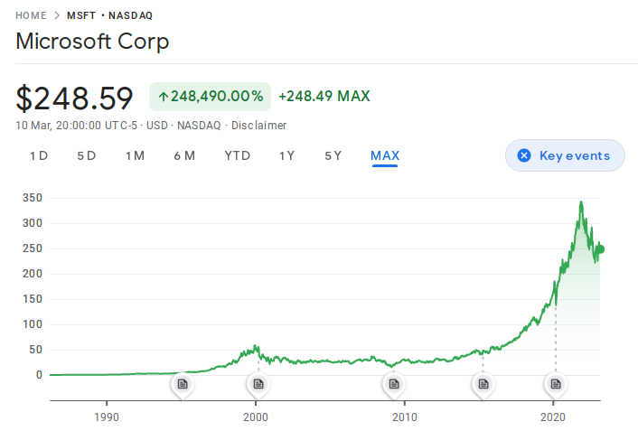

# Read Stock Quotes Example

Use GitHub Copilot to write a small Python program to demonstrate how to read
stock quotes using the [Alpha Vantage](https://www.alphavantage.co/) API.

## Method

1. read stock symbol from the command line
1. retrieve `ALPHAVANTAGE_API_KEY` from environment variable
1. call Alpha Vantage API to get stock quotes
1. store stock quotes to a Pandas dataframe
1. print to console
1. plot stock quotes to a chart (closing price by date) using Matplotlib

## Example

```bash
./get_weekly_quotes.py MSFT
               open    high     low   close       volume
1999-11-12   84.810   90.75   84.37   89.19  270831600.0
1999-11-19   88.250   88.50   84.37   86.00  147891900.0
1999-11-26   89.620   93.37   88.37   91.12  121834600.0
1999-12-03   90.120   97.12   89.50   96.12  142022200.0
1999-12-10   95.250   97.19   91.44   93.87  115003700.0
    …          …        …       …       …             …
2023-02-10  257.440  276.76  254.78  263.10  196239002.0
2023-02-17  267.640  274.97  256.00  258.06  170244679.0
2023-02-24  254.480  256.84  248.10  249.22  105098500.0
2023-03-03  252.460  255.62  245.61  255.29  126840033.0
2023-03-10  256.425  260.12  247.60  248.59  117910562.0

[1218 rows x 5 columns]
```

## MSFT Stock Quote



Compare with Google Finance:



## Build

This project was originally built locally using Python 3.11.2.

GitHub only supports up to Python 3.10 in their workflows…

## Resources

Python documentation is
[here](https://frankhjung.github.io/python-copilot-demo/).

Software used in this project:

* [Alpha Vantage API](https://www.alphavantage.co/documentation/)
* [Black](https://black.readthedocs.io/en/stable/)
* [Flake8](https://flake8.pycqa.org/en/latest/)
* [isort](https://pycqa.github.io/isort/)
* [Make](https://www.gnu.org/software/make/)
* [Matplotlib](https://matplotlib.org/)
* [Pandas](https://pandas.pydata.org/)
* [PyDoc](https://pypi.org/project/pdoc/)
* [PyLint](https://www.pylint.org/)
* [PyTest](https://docs.pytest.org/en/stable/)
* [Python](https://python.org)
* [sort-requirements](https://pypi.org/project/sort-requirements/)

## Other Tools

* [GitHub Copilot Labs](https://githubnext.com/projects/copilot-labs) provides
  additional Copilot features, including explain code, translate code, and write
  unit tests

* [OpenAI playground](https://platform.openai.com/playground) is a research
  project to experiment with different pre-trained AI models developed by OpenAI
  in natural language processing (NLP), computer vision, and other AI domains

  * The [other](./other) directory contains example code where Copilot was used
    to write a Python script, then Labs was used to translate into Ruby.

* [Hugging Face StarCoder](https://huggingface.co/blog/starcoder) is a LLM model
  released by Hugging Face specifically for code generation.

* [Hugging Face Code Search](https://huggingface.co/spaces/bigcode/search) is a
  search engine for code, trained on 2.8M Python files from GitHub.
